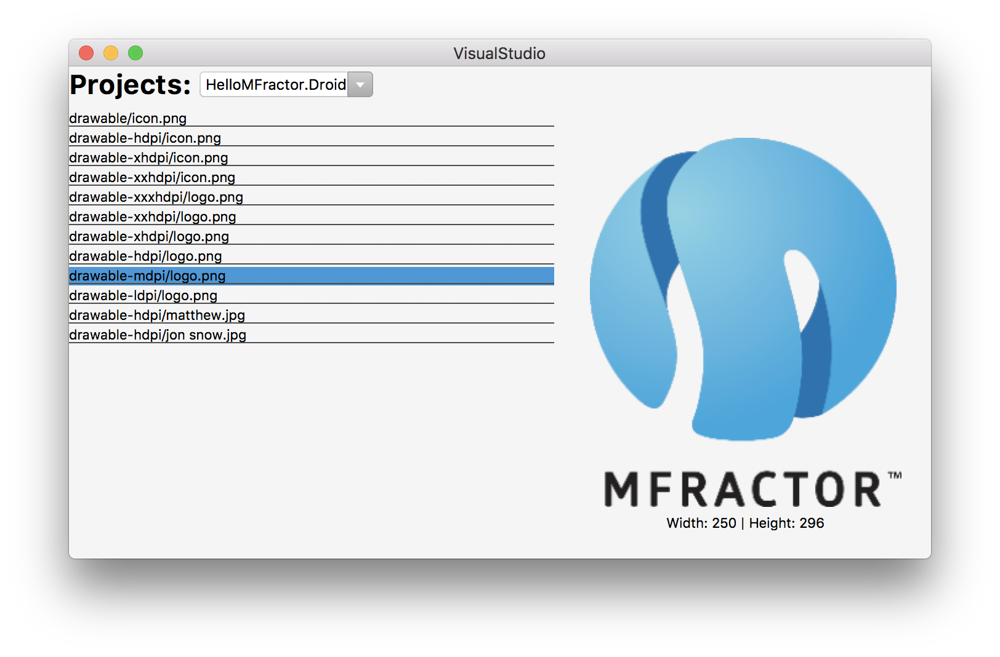

# Xamarin.Forms In Visual Studio Mac

*Learn to use Xamarin.Forms to build user interfaces for your Visual Studio Mac extensions.*

## Important 🚨

**MFractor has removed all Xamarin.Forms interfaces as of October 2018. Unfortunately, using Xamarin.Forms inside Visual Studio Mac caused instability and in the end, we decided that this technique was not commercially viable.**

**If you choose to use Xamarin.Forms to build UIs, use with caution.**

## Introduction

Ever since I commercialised MFractor in June 2017, I've been pulled to the idea of using XAML and Xamarin.Forms to build user interfaces for Visual Studio Mac extensions.

For MFractor, developing tools like the Image Wizard or localisation wizard cost days to weeks of engineering effort. As a bootstrapped business, this time-cost makes it prohibitively expensive to develop tools that are UI-centric.

Therefore, there are compelling reasons to use Xamarin.Forms to build Visual Studio Mac extensions:

 * XAML is much, much easier to work with than XWT, Visual Studio Macs UI framework. This dramatically lowers the barrier to entry for developing Visual Studio Mac extensions.
 * We can use data-binding to save a lot of "glue" code and can also make use of value converters, triggers and behaviours.
 * With a Xamarin.Forms WPF backend available, user interfaces are reusable in both Visual Studio Mac **and** Visual Studio Windows.
 * By using XAML to build MFractors UIs, I can use MFractor to build itself; an awesome process of dogfooding to accelerate product development.

There are huge productivity gains here!

To prove that this technique is valid for production-ready tooling and is not just a toy, we'll be building an image asset browser you can use to visually explore images inside a solution:



So, read on to learn how to use Xamarin.Forms inside Visual Studio Mac to build rich user interfaces for your tooling.

## Using Xamarin.Forms Inside Visual Studio Mac

Let's get started!

First things first, you **must** have version 1.4.2 of the Addin Maker installed into Visual Studio Mac. Based on my many, many failed attempts at getting this to work, AddinMaker v1.4.2 is the one that works.

Next, you'll need to create a new Visual Studio Mac extension that is an SDK style project and references the NuGet MonoDevelop.Addins v0.4.4. I've found that the Xamarin.Forms bootstrapping process does not work in Visual Studio Mac extensions that are not SDK style projects.

If you have an existing extension, you'll need to upgrade your main extensions project to an SDK style project and reference NuGet MonoDevelop.Addins v0.4.4. The best way to do this is to create a new extension project within the existing solution and then copy paste all the code files from the old project into the new project.

After you've setup your project, it's time to set up Xamarin.Forms inside our extension.

Firstly, we need to add the `Xamarin.Forms.Platform.GTK` nuget into our project. At the time of writing, this is only available within the Xamarin.Forms nightly builds. You can find instructions to add the nightly builds feed [here](https://blog.xamarin.com/try-the-latest-in-xamarin-forms-with-nightly-builds/).

In the solution explorer panel, locate your extensions project, open **Dependencies** and then double click on the **NuGet** item.

Once the package explorer has opened, search for **Xamarin.Forms.Platform.GTK** and then add it.

Before we can show any user interfaces built using Xamarin.Forms, we need to startup Xamarin.Forms by calling `Forms.Init()`.

We do this by creating a `CommandHandler` that invokes `Forms.Init()` within its `Run()` method like so:

**InitXamarinFormsCommand.cs**
```
public class InitXamarinFormsCommand : CommandHandler
{
	protected override void Run()
	{
        Forms.Init();
        Console.WriteLine("Xamarin.Forms has been initialised");
	}
}
```

And then in our `Manifest.addin.xml` we insert our `InitXamarinFormsCommand` into the `/MonoDevelop/Ide/StartupHandlers` extension point:

**Manifest.addin.xml**
```
<Extension path="/MonoDevelop/Ide/StartupHandlers">
    <Class class="XamarinFormsUIs.Commands.InitXamarinFormsCommand"/>
</Extension>
```

When the IDE opens, the `Run()` method of `InitXamarinFormsCommand` will be invoked and it will startup Xamarin.Forms!

Next, it's time to create our user interface.

As we are now using Xamarin.Forms, we can create our view in XAML and also create an accompanying view model.

 * [ImageAssetBrowserView.xaml](src/XamarinFormsUIs/Views/ImageAssetBrowserView.xaml)
 * [ImageAssetBrowserViewModel.cs](src/XamarinFormsUIs/ViewModels/ImageAssetBrowserViewModel.cs)

To display the user interface for the Image Asset Browser, we use [native embedding](https://blog.xamarin.com/unleashed-embedding-xamarin-forms-in-xamarin-native/) to convert our Xamarin.Forms UI into a conrol that can be used inside a GTK window. As we working with GTK, we call the extension method `.CreateContainer()` to convert a `Xamarin.Forms.Page` into a `Gtk.Container` class that can be inserted into a `Gtk.Window`.

Our `ImageAssetBrowserWindow` looks like this:

**ImageAssetBrowserWindow.cs&**
```
public class ImageAssetsWindow : Gtk.Window
{
    public ImageAssetsWindow()
        : base(Gtk.WindowType.Toplevel)
    {
        var page = new ImageAssetBrowserView();

        page.BindingContext = new ImageAssetBrowserViewModel(MonoDevelop.Ide.TypeSystem.TypeSystemService.Workspace.CurrentSolution);

        this.Add(page.CreateContainer());
        SetDefaultSize((int)page.WidthRequest, (int)page.HeightRequest);
        SetSizeRequest((int)page.WidthRequest, (int)page.HeightRequest);
    }
}
```

This creates a window that specifically shows the `ImageAssetBrowserView` and binds it to the `ImageAssetBrowserViewModel`.

Lastly, we create a new `CommandHandler` to show our user interface:

**BrowseImageAssetsCommand.cs**
```
public class BrowseImageAssetsCommand : CommandHandler
{
	protected override void Update(CommandInfo info)
	{
        info.Enabled = true;
        info.Visible = true;
	}

    protected override void Run()
    {
        new ImageAssetsWindow().Show();
    }
}
```

And then we expose the `BrowseImageAssetsCommand` through the tools menu by adding the command into the extensions manifest:

**Manifest.addin.xml**
```
<Extension path="/MonoDevelop/Ide/Commands">
    <Command _label="Browse Image Assets"
             id="XamarinFormsUIs.Commands.BrowseImageAssetsCommand"
             description="Allows you to visually explore the image assets in your solution."
             defaultHandler="XamarinFormsUIs.Commands.BrowseImageAssetsCommand"/>
</Extension>

<Extension path = "/MonoDevelop/Ide/MainMenu/Tools">
    <CommandItem id="XamarinFormsUIs.Commands.BrowseImageAssetsCommand"/>
</Extension>
```

Voila! Now we have a working image browser that's driven using *Xamarin.Forms*!

## Summary

Creating our user interfaces in Xamarin.Forms for our Visual Studio Mac extension has huge benefits. It's much to build UIs with XAML, we get to used lovely MVVM architecture and Xamarin.Forms is much better documented than Xwt.

Unfortunately, this methodology is not without it's issues. As more extension developers start using this technology, it's that many extension developers will bundling and loading their own Xamarin.Forms binaries, resulting in assembly loading race conditions and versioning mis-matches. This causes big problems issues in Visual Studio for Mac, often causing instability in the core product.

In the future, we will need an official Visual Studio Mac Xamarin.Forms extension to prevent multiple calls to Forms.Init() and potential assembly version conflicts.
